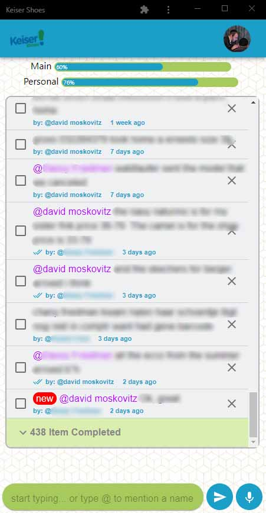

this project is a real time chat/todoList I made for the shop I work.
the technologies I used are: React, Firebase and Material-ui.
Please don't see this project as the way or cleanness I write code, just to see my familiarity with the technologies I used.

